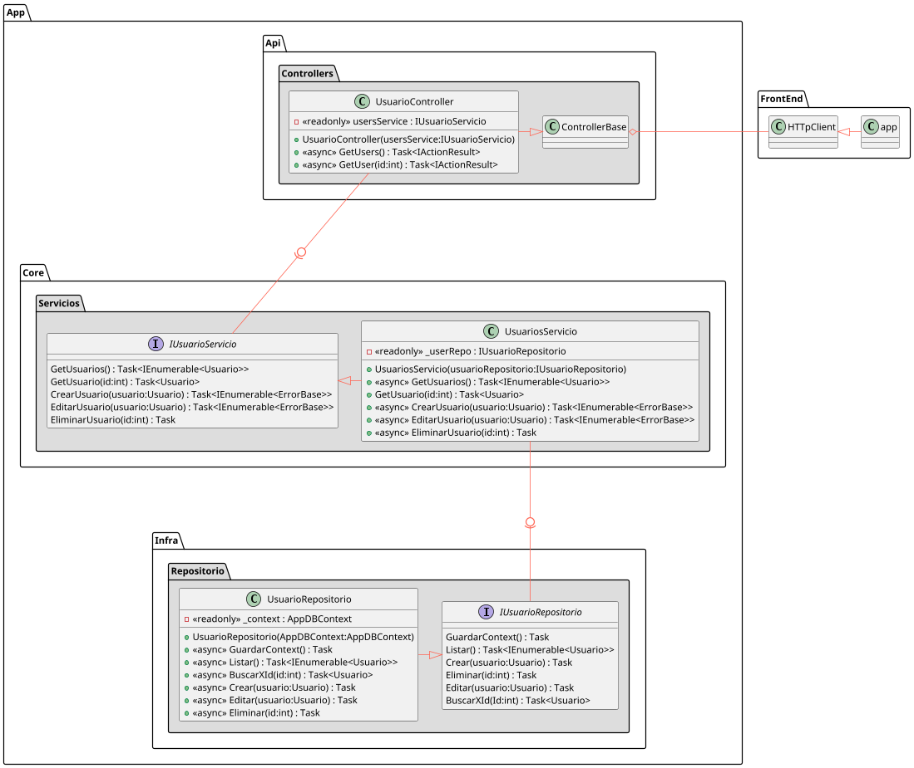

# appdemo

## Coverage
[](https://coveralls.io/github/wkrea/appdemo?branch=main)
[](https://sonarcloud.io/dashboard?id=wkrea_appdemo)

## QA metrics
[](https://sonarcloud.io/dashboard?id=wkrea_appdemo)
[](https://sonarcloud.io/dashboard?id=wkrea_appdemo)
[](https://sonarcloud.io/dashboard?id=wkrea_appdemo)
[](https://sonarcloud.io/dashboard?id=wkrea_appdemo)
[](https://sonarcloud.io/dashboard?id=wkrea_appdemo)

Aplicación demo para aplicación de metodología modular

La aplicación puedes ser ejecutada de varias maneras para propósitos de desarrollo y/o prueba.

## Emplear una Base de Datos en memoria

Escenario facilita la ejecución del aplicativo en modo de prueba O desarrollo de forma que no requerirá hacer ningún ajuste pues toda la configuración del aplicativo está realizada por defecto dentro del repositorio.

### Ejecución

1. Ubicado en `appdemo\BackEnd\App.Api`
2. Ejecute `dotnet build` y luego Ejecute `dotnet run`
3. Verifique que puede obtener un resultado en alguna de las siguientes rutas
     * [https://localhost:5001/api/users](https://localhost:5001/api/users)
     * [http://localhost:5000/api/users](http://localhost:5000/api/users)

## Empleando una Base de Datos en Docker

Para facilitar el despliegue y prueba de la aplicación se puede apoyar del archivo docker-compose ubicado en la raíz de repositorio en el se crea un servicio de base de datos para el cual ya se han definido nombres de base de datos y contraseñas compatibles con el aplicativo de no de manera que no se requiere hacer ningún ajuste

### Ajustes previos

Ajuste el archivo `BackEnd\App.Api\ServiceExtensions.cs`
para utilice la sentencia:

```C#
optionsBuilder.UseSqlServer(connectionString); // SqlServer
```

en vez de:

```C#
optionsBuilder.UseInMemoryDatabase("db_memoria"); // En memoria
```

o viceversa, según sea el caso de su preferencia.

### Ejecución Local de la aplicación AppDemo

1. Ubicado en `appdemo`
2. Ejecute `docker-compose up db`
3. Ubiquese en `appdemo\BackEnd\App.Api`
4. Ejecute `dotnet build` y luego Ejecute `dotnet run`
5. Verifique que puede obtener un resultado en alguna de las siguientes rutas
   * [https://localhost:5001/api/users](https://localhost:5001/api/users)
   * [http://localhost:5000/api/users](http://localhost:5000/api/users)

## Arquitectura


### Visión General (appdemo)

```plantuml
!include ./Assets/Overview_appdemo.puml
```




### Vista Detallada (appdemo)

```plantuml
!include ./Assets/Detail_appdemo.puml
```

<!-- 
<iframe width="100%" height="500" src=http://www.plantuml.com/plantuml/proxy?cache=no&src=https://raw.githubusercontent.com/wkrea/appdemo/main/Assets/Detail_appdemo.puml>

</iframe> -->

## Referencias

* [UML conventions](https://crashedmind.github.io/PlantUMLHitchhikersGuide/PlantUMLSpriteLibraries/plantuml_sprites.html)
* [Component UML Diagrams Plantuml](https://real-world-plantuml.com/umls/4860331021041664)
* [Proxy render UML](https://github.com/jonashackt/plantuml-markdown#2-integrate-plantuml-render-engine-with-github-markdown)
* [plantuml-styles renders](https://github.com/wkrea/plantuml-styles)
* [repository-pattern-csharp](https://codewithshadman.com/repository-pattern-csharp/)
